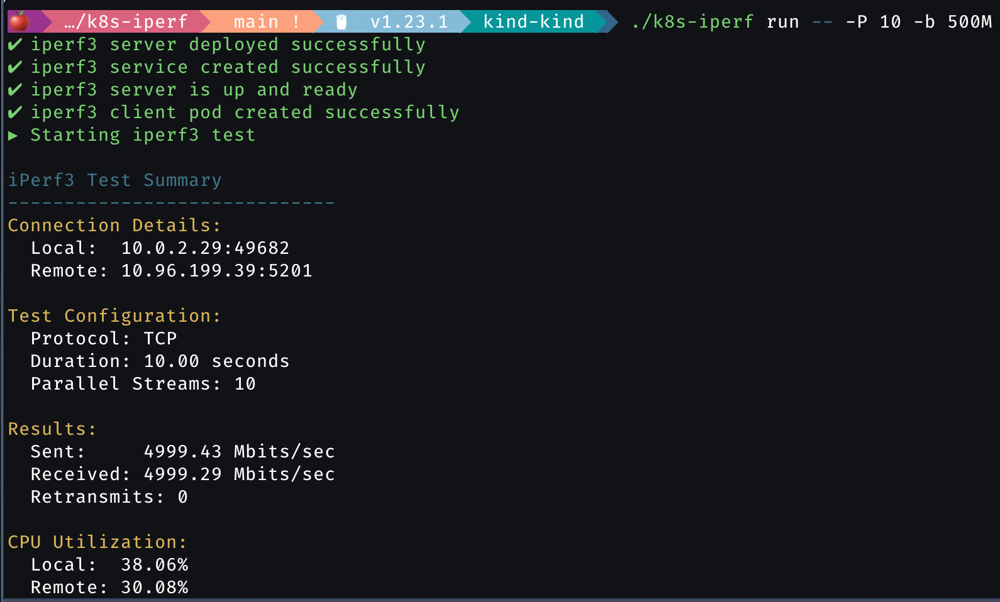

# k8s-iperf




k8s-iperf is a tool to test the network performance between two nodes in a Kubernetes cluster using iperf3.

## Installation

To use k8s-iperf, you need to have access to a Kubernetes cluster and the `kubectl` command-line tool configured.

## Usage

The basic command to run an iperf test is:

```
k8s-iperf run
```

### Flags

- `--k8s-namespace` Specify the Kubernetes namespace to run the test in (default: "default")
- `--k8s-image` Specify the Docker image to use for the test (default: "dariomader/iperf3:latest")
- `--k8s-server-node` Specify the Kubernetes node to run the iperf3 server on
- `--k8s-client-node` Specify the Kubernetes node to run the iperf3 client on

### Iperf Arguments

You can pass additional iperf3 arguments after the `--` separator. These will be forwarded to the iperf3 client.

### Examples

1. Run a basic iperf test in the default namespace:
   ```
   k8s-iperf run
   ```

2. Run a test in a specific namespace:
   ```
   k8s-iperf run --k8s-namespace mynetwork
   ```

3. Use a custom iperf3 image:
   ```
   k8s-iperf run --k8s-image myrepo/custom-iperf3:v1
   ```

4. Run a test between specific nodes:
   ```
   k8s-iperf run --k8s-server-node node1 --k8s-client-node node2
   ```

5. Pass additional iperf3 arguments:
   ```
   k8s-iperf run -- -t 30 -P 4
   ```
   This runs a 30-second test with 4 parallel streams.

6. Combine flags and iperf3 arguments:
   ```
   k8s-iperf run --k8s-namespace mynetwork --k8s-server-node node1 --k8s-client-node node2 -- -t 60 -R
   ```
   This runs a 60-second test in reverse mode in the "mynetwork" namespace between node1 and node2.

## Docker Image

The default iperf3 image is hosted on Docker Hub:

```
docker pull dariomader/iperf3:latest
```

You can also build the image yourself using the Dockerfile in this repository.
